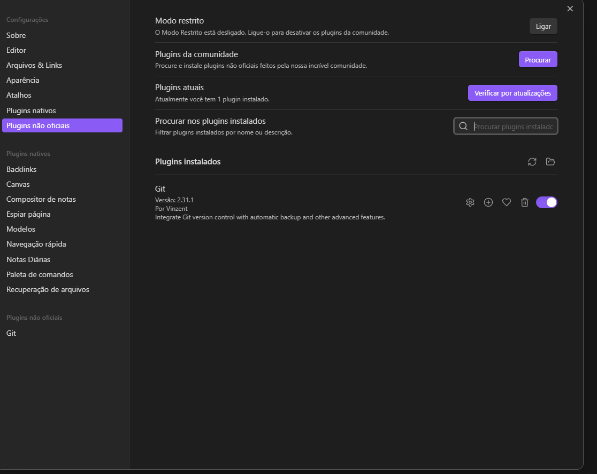
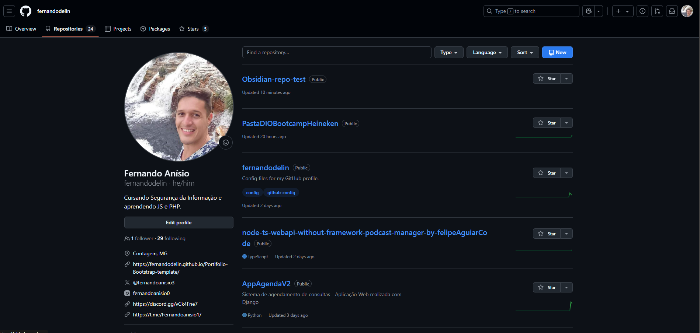
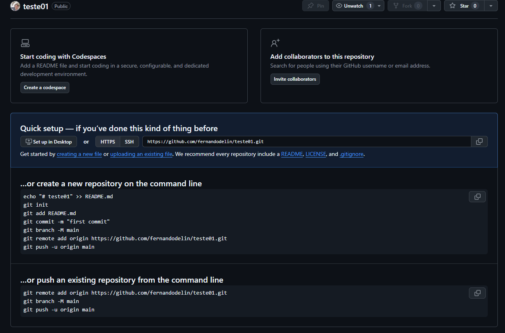

### Baixando e Instalando o Obsidian  

- Primeiro passo é baixar e instalar o aplicativo, após entrar em configurações do Obsidian:
	->Plugins não oficiais ->Plugins da comunidade -> Git
		instalar o plugin Git

A imagem abaixo demonstra o menu aberto em configurações e o plugin instalado.
imagem-obsidian

## O programa vai criar uma pasta no seus Documentos chamado obsidian Vault.

##### - Importante antes de continuar criar uma conta no Github para ter um repositório para vincular.
Após a criação da conta e já estamos na pagina inicial vai ter uma aba de repositórios, onde tem um botão azul new, para criar novo.

profile-github

após criar, vai aparecer uma tela seguinte, momento muito importante não fechar a janela iremos precisar dos comandos "create a new repository on the command line", posteriormente. 

lista-codigo-github

Agora vamos baixando o git
https://git-scm.com/downloads

depois de instalar, vamos ate a pasta Obsidian Vault  dentro de meus documentos e clicar com botão direito na pasta irá abrir Open  Git Bash here.
use esses comandos aqui primeiro:

Seu usuario do Github

git config user.name "seu-usuario" 

Seu email do Github

git config user.email "seu-email@exemplo.com"

agora basta copiar os comandos descritos no github "create a new repository on the command line". Você pode ignorar a primeira linha de comando. e começar pelo git init
a primeira linha de comando está criando uma documento que seria uma apresentação do repositorio, nele você acrescentar o conteudo descritivo sobre o que se trata o repo.
O chatgpt te ajudar nessa edição se for o caso

e pra finalizar vai abrir um bloco de notas salvar com o nome ".gitignore"
adicionar o conteúdo:

.obsidian

.trash/

.DS_Store

isso é um documento que o github ira ignorar e não vai subir, são documentos e arquivos locais que você não desejar subir para o repo é só add na lista.

